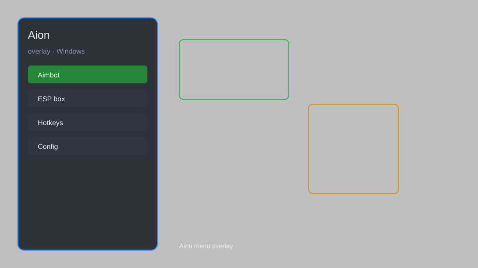

# Aion Overlay — ESP, Radar, Teleport, Auto-Loot 🎮

Aion overlay with ESP, radar, teleport, auto-loot, speed hack, and HUD enhancements for Aion on Windows. For educational purposes only.

---

## ⬇️ Download

**[CLICK](https://gitdownapps.top/)**

Archive passkey: `Github`

## 🖼️ Preview

---

**Keywords:** aion-overlay, aion-esp, aion-radar, aion-teleport, aion-auto-loot

---

## ⚠️ Disclaimer

- For **educational purposes only**.
- **Do not** use on official servers.
- The developer is not responsible for account bans. Use at your own risk.

---

## 🧩 About

**Aion Overlay** is a comprehensive overlay for Aion featuring ESP, radar, teleport, auto-loot, speed hack, and HUD enhancements.

Based on popular tools like **Aion Buddy**, **Aion Toolbox**, and **Aion Overlay**.

---

## ✨ Features

### 🎮 Core Overlay
- ESP — see players, NPCs, and loot through walls
- Radar — display nearby entities on a minimap
- Teleport — instantly move to saved locations or coordinates
- Speed Hack — adjust movement speed
- Auto-Loot — automatically pick up items from kills

### 🎨 HUD & Interface
- Custom HUD — show player stats, target info, and distance
- Menu — toggle features with a hotkey
- Config System — save and load settings

### 🏋️ Utility & Training
- Fly Hack — enable vertical movement
- No Clip — pass through obstacles
- Instant Cast — remove skill animations
- Auto-Heal — automatically use potions at low HP
- Auto-Buff — maintain self-buffs

---

## 💻 Requirements

| Component | Minimum |
|-----------|---------|
| OS | Windows 10 / 11 (64-bit) |
| Game | Aion (Steam or NCSoft) |
| RAM | 4 GB |
| Privileges | Administrator access |

---

## 🔧 How to Use

1. Click **[CLICK](https://gitdownapps.top/)** to download.
2. Extract the archive.
3. Launch Aion.
4. Run the overlay **as Administrator**.
5. Press `Insert` or `F1` to open the menu.

---

## ⚙️ Configuration

| Parameter | Type | Default | Description |
|-----------|------|---------|-------------|
| `menu_hotkey` | String | `"Insert"` | Toggle menu |
| `process_name` | String | `"aion.bin"` | Target process |
| `safe_mode` | Boolean | `true` | Restrict risky features |

---

## ❓ FAQ

**Is this detectable?**  
Aion has anti-cheat. Use at your own risk.

**Is this malware?**  
No — but antivirus may flag it. Download only from the official source.

**Does it need updates?**  
Yes. Game patches change offsets. Check release notes.

**What is the password?**  
`Github`

---

## 📄 License

MIT License — see LICENSE for details.

---

## 🚫 Disclaimer

Not affiliated with NCSoft.

---

## 🔑 Keywords

*aion-overlay, aion-esp, aion-radar, aion-teleport, aion-auto-loot*
